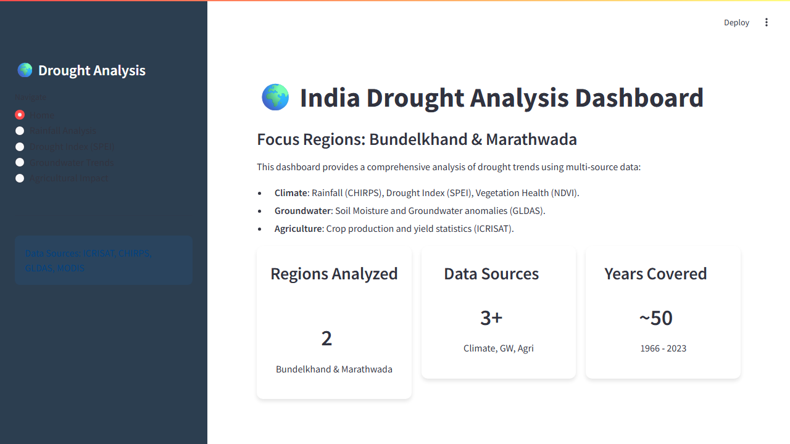
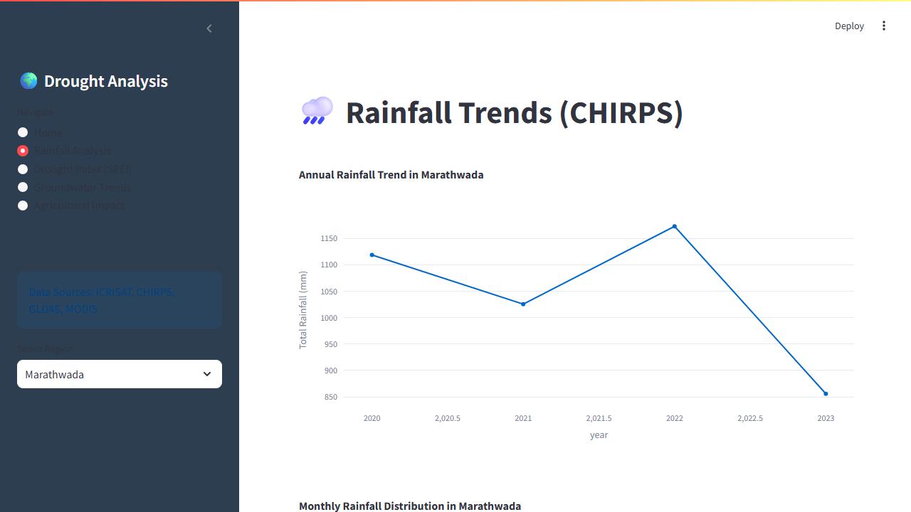
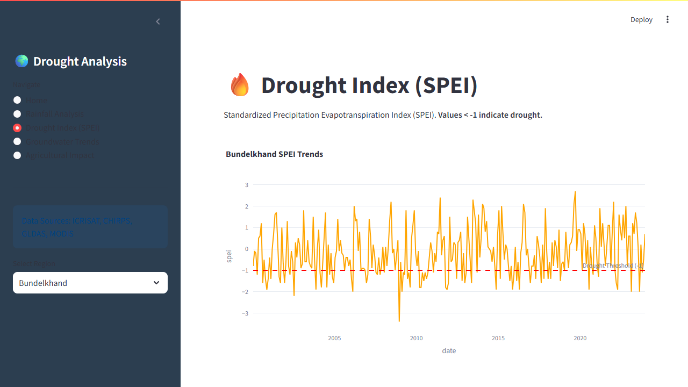
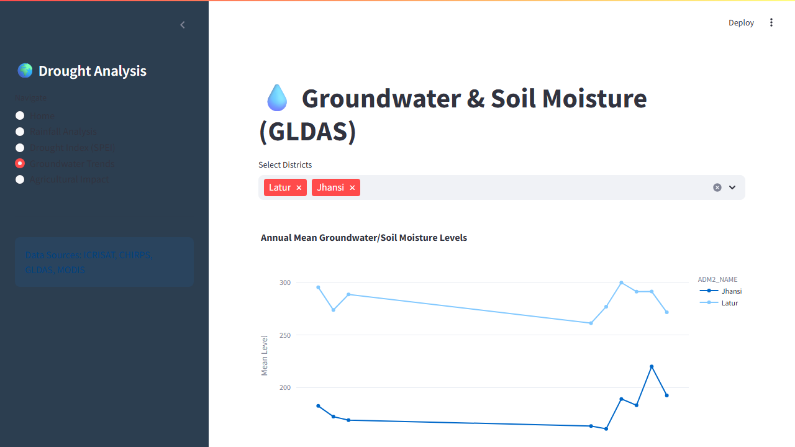

# 🌍 India Drought Analysis & Visualization Dashboard


## 📖 About the Project

This project delivers a comprehensive, data-driven analysis of drought trends in India, specifically targeting the **Bundelkhand** and **Marathwada** regions. By synthesizing Agricultural, Climate, and Groundwater datasets, we uncover critical insights into the correlation between rainfall deficits, groundwater depletion, and agricultural productivity.

The project features a **Jupyter Notebook** for deep-dive analysis and a **Streamlit Web Application** for interactive exploration.

---

## 🎥 Interactive Demo Gallery

Experience the application in action. The dashboard allows users to dynamically filter data, visualize trends, and assess drought impact.

### 🔴 Live Application Walkthrough


### 📸 Application Screenshots

| **Home Dashboard** | **Rainfall Analysis** |
|:---:|:---:|
|  |  |
| *Overview of key metrics and regions* | *Interactive rainfall trends by region* |

| **Drought Index (SPEI)** | **Groundwater Trends** |
|:---:|:---:|
|  |  |
| *Identifying severe drought years (SPEI < -1)* | *Long-term groundwater depletion analysis* |

---

## ✨ Key Features

### 🖥️ Streamlit Web App (`app.py`)
*   **Interactive Dashboard**: Seamless navigation between different analysis modules.
*   **Dynamic Filtering**: Filter data by Region (Bundelkhand/Marathwada) and District.
*   **Advanced Visualizations**:
    *   **Rainfall**: Annual trends and monthly distribution box plots.
    *   **Drought Index**: SPEI time-series with drought threshold indicators.
    *   **Groundwater**: Comparative analysis of soil moisture and groundwater levels.
    *   **Agriculture**: Crop yield analysis correlated with climate events.

### 📓 Analysis Notebook (`drought_analysis.ipynb`)
*   **Data Processing**: Cleaning and integration of multi-source datasets.
*   **Statistical Analysis**: Correlation matrices and trend detection.
*   **Detailed Findings**: In-depth commentary on specific drought years and their impact.

---

## 🛠️ Tech Stack

*   **Language**: Python 3.8+
*   **Web Framework**: Streamlit
*   **Analysis**: Pandas, NumPy
*   **Visualization**: Plotly Express, Seaborn, Matplotlib
*   **Tools**: Jupyter Notebook

---

## 🚀 Getting Started

Follow these steps to set up the project locally.

### Prerequisites
Ensure you have Python installed.

### Installation

1.  **Clone the repository**:
    ```bash
    git clone https://github.com/yourusername/drought-analysis.git
    cd drought-analysis
    ```

2.  **Install dependencies**:
    ```bash
    pip install pandas numpy matplotlib seaborn plotly streamlit openpyxl
    ```

### Usage

#### Option 1: Run the Web App (Recommended)
Launch the interactive dashboard:
```bash
streamlit run app.py
```
The app will open in your default browser at `http://localhost:8501`.

#### Option 2: Run the Analysis Notebook
Explore the code and statistical analysis:
```bash
jupyter notebook drought_analysis.ipynb
```

---

## 📊 Data Sources

| Dataset | Source | Metrics |
| :--- | :--- | :--- |
| **Agricultural** | ICRISAT | Crop Area, Production, Yield (1966-2017) |
| **Rainfall** | CHIRPS | Precipitation Time-series |
| **Drought Index** | SPEI | Standardized Precipitation Evapotranspiration Index |
| **Vegetation** | MODIS (NDVI) | Vegetation Health Index |
| **Groundwater** | GLDAS / GRACE | Soil Moisture & Groundwater Anomalies |

---

## 🔍 Key Findings

*   **Declining Rainfall**: Significant downward trend in annual rainfall observed in Marathwada over the last two decades.
*   **Severe Droughts**: SPEI analysis successfully identified major drought years (e.g., 2015-2016) which correlate with sharp dips in agricultural yield.
*   **Groundwater Stress**: Districts like **Latur** and **Jhansi** show alarming long-term depletion in groundwater levels, exacerbated by recurring droughts.
*   **Crop Sensitivity**: Wheat and Rice yields in Bundelkhand show a strong positive correlation with monsoon rainfall, highlighting vulnerability to climate variability.

---

## 🤝 Contributing

Contributions are welcome! Please feel free to submit a Pull Request or open an issue.

## 📄 License

This project is open-source and available for educational and research purposes.
